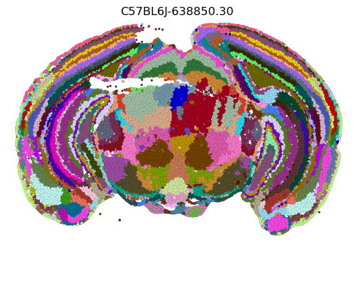

# Contents of Repo
This repo contains several items necessary to reproduce the paper 
"Data-driven fine-grained region discovery in the mouse brain with transformers". 

CellTransformer was trained on a machine with 128GB RAM and 2 NVIDIA A6000 GPUs, running Ubuntu 22.04. Training memory usage did not exceed 64 GB RAM and did not require a full 48 GB of GPU memory on the A6000 cards; however we strongly reccomend using a system with at least this amount of RAM and a 24 GB GPU (ex. RTX 3090, 4090 or A5000 and above). 

On our system performant results can be generated in as few as 10 epochs (~2.5 hrs per epoch on 1 GPU), 

1. the package `celltransformer` which is pip installable
	- we also provide a Dockerfile
	- installation will require a couple minutes on a normal server assuming you have CUDA installed (see NVIDIA documentation for this); you will require a GPU for training and very likely inference

2. `mkdocs` automatic documentation which is hosted at github.com/abbasilab/celltransformer 
	- to build the docs, pip install `docs/requirements.txt`
	- the items in the documentation include:
		* a walkthrough of how to use the package to train a transformer model using our objective on the AIBS MERFISH data -- configuration is limited to setting paths to the data using `hydra` config files (a brief tutorial is provided), and we provide a minimal example of how to do so
		* descriptions of the model data requirements (ie what attention matrix formats, how the data is passed to the model itself)
		* non-technical descriptions (as well as some code contextualization descriptions) of the dataloader and the format that is output by it, including both single-sample `__getitem__` level logic and logic to collate the single neighborhoods across batches at the PyTorch dataloader level
		* automatic documentation from the code itself assembled as an API reference; critical items (models, loaders) are extensively documented and type-annotated
3. scripts and ipynb files to perform basic analyses 
	- scripts are a minimal `argparse` interface over code to get embeddings from a trained model and dataset and to cluster them using the `cuml` we used in the paper
	- ipynb files principally describing the workflows after the model is generated 
		- again, clustering the data after embeddings and visualization (because the number of clusters can be large, sometimes it is slightly nontrivial to visualize them), ex:
		
		
		- smoothing the embeddings on the spatial graph (see paper)
		- counting the number of different single-cell types (from reference atlas) in a spatial cluster (code can also be used to do so for CCF regions, whatever class labeling etc.)

# Installation

Clone this repo and pip install, or run:
```
pip install git+https://github.com/abbasilab/celltransformer
```

As a last option you can run and build the Dockerfile, which includes all necessary software (e.g. CUDA).

# Model and data sharing

* all data used in this repository was publicly available from the Allen Brain Cell dataset. See https://alleninstitute.github.io/abc_atlas_access/intro.html for more information. 

# Citation

If this is useful to you, please consider citing: 

```

@ARTICLE{Lee2024-bh,
  title    = "Data-driven fine-grained region discovery in the mouse brain with
              transformers",
  author   = "Lee, Alex J and Dubuc, Alma and Kunst, Michael and Yao, Shenqin
              and Lusk, Nicholas and Ng, Lydia and Zeng, Hongkui and Tasic,
              Bosiljka and Abbasi-Asl, Reza",
  journal  = "bioRxivorg",
  pages    = "2024.05.05.592608",
  month    =  feb,
  year     =  2025,
  language = "en"
}

```
